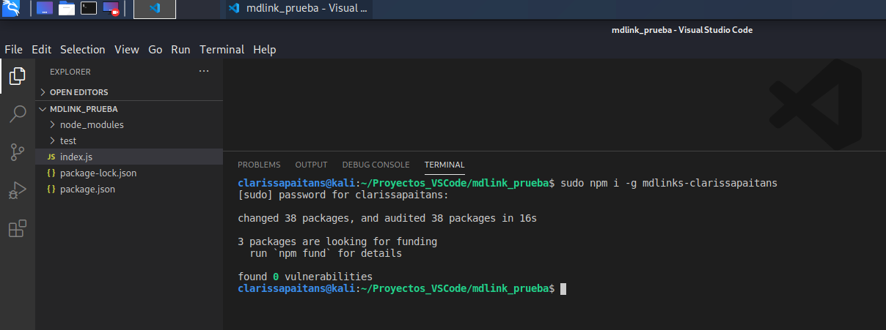
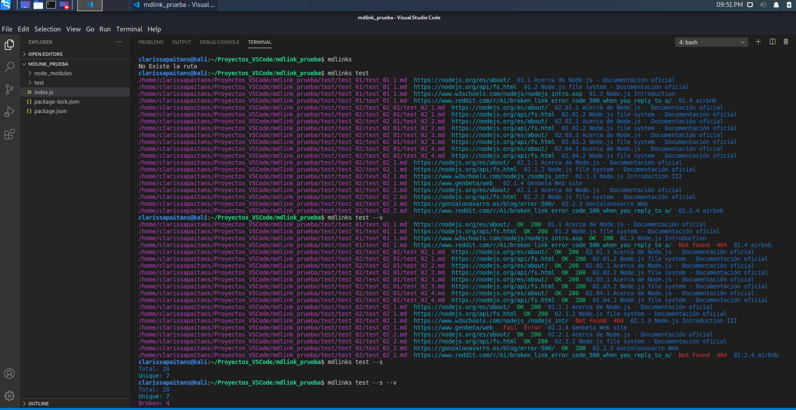

# 🔗 Markdown Links
Esta libreria ayuda a extraer los links de archivos con extensión markdown e identificar su status de cada uno.

## Instalación de Librería:

### Windows:

```sh

npm i mdlinks-clarissapaitans
```
### Linux:

```sh

sudo npm i -g  mdlinks-clarissapaitans
```

#### Importar la librería:

####
```js

const {mdLinks} = require('mdlinks-clarissapaitans');

mdLinks("./some/example.md", { validate: false }) //Valor de validate es false
  .then(links => {
    // => [{ href, text, file }]
  })
  .catch(console.error);

mdLinks("./some/example.md", { validate: true }) //Valor de validate es true
  .then(links => {
    // => [{ href, text, file, status, message }]
  })
  .catch(console.error);

mdLinks("./some/example.md")
  .then(links => {
    // => [{ href, text, file }]
  })
  .catch(console.error);
```

### CLI (Command Line Interface - Interfaz de Línea de Comando)

El ejecutable de nuestra aplicación debe poder ejecutarse de la siguiente
manera a través de la terminal:

`mdlinks <path-to-file> [options]`

Por ejemplo:

```sh
$ mdlinks ./some/example.md
./some/example.md http://algo.com/2/3/ Link a algo
./some/example.md https://otra-cosa.net/algun-doc.html algún doc
./some/example.md http://google.com/ Google
```

El comportamiento por defecto no debe validar si las URLs responden ok o no,
solo debe identificar el archivo markdown (a partir de la ruta que recibe como
argumento), analizar el archivo Markdown e imprimir los links que vaya
encontrando, junto con la ruta del archivo donde aparece y el texto
que hay dentro del link.


#### Options

##### `--validate`

Si pasamos la opción `--validate`, el módulo debe hacer una petición HTTP para
averiguar si el link funciona o no. Si el link resulta en una redirección a una
URL que responde ok, entonces consideraremos el link como ok.

Por ejemplo:

```sh
$ mdlinks ./some/example.md --validate
./some/example.md http://algo.com/2/3/ ok 200 Link a algo
./some/example.md https://otra-cosa.net/algun-doc.html fail 404 algún doc
./some/example.md http://google.com/ ok 301 Google
```

Vemos que el _output_ en este caso incluye la palabra `ok` o `fail` después de
la URL, así como el status de la respuesta recibida a la petición HTTP a dicha
URL.

##### `--stats`

Si pasamos la opción `--stats` el output (salida) será un texto con estadísticas
básicas sobre los links.

```sh
$ mdlinks ./some/example.md --stats
Total: 3
Unique: 3
```

También podemos combinar `--stats` y `--validate` para obtener estadísticas que
necesiten de los resultados de la validación.

```sh
$ mdlinks ./some/example.md --stats --validate
Total: 3
Unique: 3
Broken: 1
```


# Instalación:


# Ejemplo:


